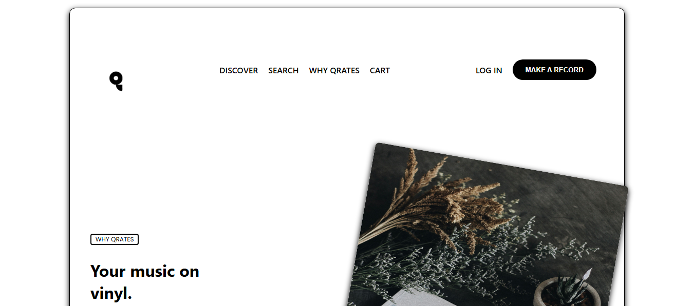
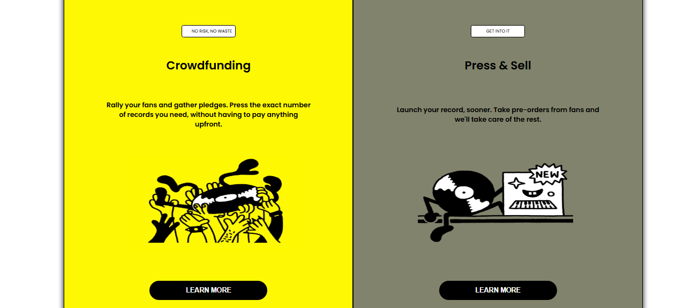
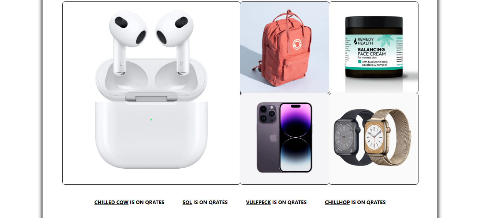
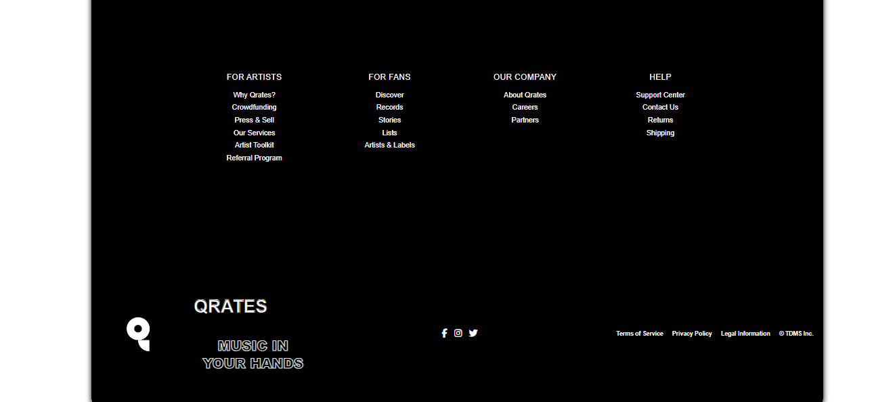

# Getting Started with Create React App

This project was bootstrapped with [Create React App](https://github.com/facebook/create-react-app).

## Available Scripts

In the project directory, you can run:

### `npm start`

Runs the app in the development mode.\
Open [http://localhost:3000](http://localhost:3000) to view it in your browser.

# 🎵 Qrates Landing Page Clone

This is a React-based front-end project that recreates a **Qrates-style landing page**.  
It uses **React, JSX, and CSS Grid/Flexbox** for layout, and includes multiple sections such as:

- Navigation bar
- Hero section
- Two-column cards (with images & text)
- Services table
- Community section
- Artists showcase

---

## 🚀 Features
- Responsive layout with **CSS Grid** and **Flexbox**
- Hover effects for interactive buttons
- Table of services with clear structure
- Reusable card sections
- Image assets integrated in design
- Clean typography using **Poppins**

---

## 🛠️ Technologies Used
- **React** (Frontend library)
- **CSS3** (Styling, Grid & Flexbox)
- **JavaScript (ES6+)**
- **React Router** (for navigation links, optional)

---

## 👩‍💻 Author

- **Randa Erfan – Frontend Developer (React)**
## 📝 Future Improvements

**Deploy to Vercel/Netlify**

## 📸 Preview

